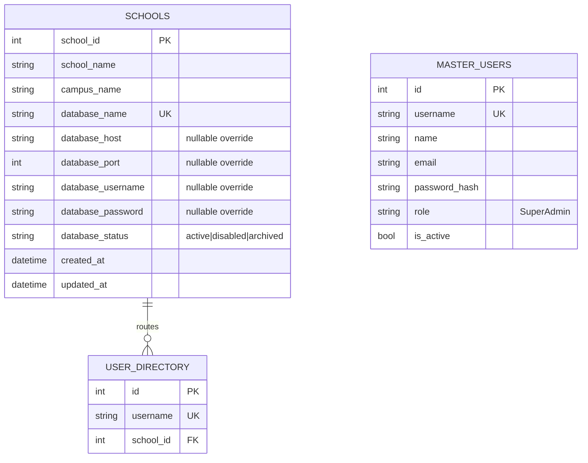
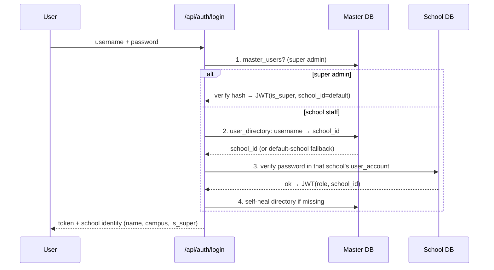
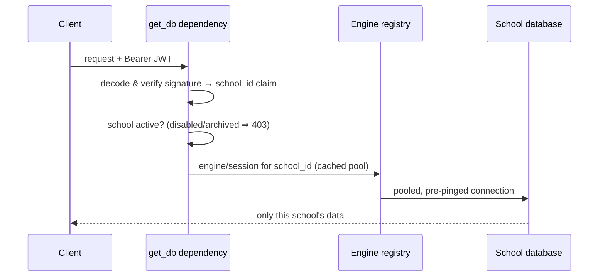

# Multi-Tenant SaaS Conversion — Complete Reference

The School Management System is now a **multi-school SaaS**: one master (control-plane) database plus **one fully separate PostgreSQL database per school**. Every school behaves like its own application; no school can ever see another school's data. The frontend UI is unchanged apart from the new super-admin school management screens.

---

## 1. Project Architecture

```mermaid
flowchart LR
    subgraph Clients
        B[Browser / Phone]
    end
    subgraph Render["Backend (FastAPI, Render)"]
        AUTH[Login router]
        API[All existing routers\n(students, fees, attendance, ...)]
        MASTERAPI[/api/master\nSuper-admin control plane/]
        REG[Tenant engine registry\nper-school connection pools]
    end
    subgraph Neon["PostgreSQL (Neon)"]
        M[(sms_master\nschools · master_users · user_directory)]
        S1[(school 1 DB\noriginal database)]
        S2[(bright_future_raabia_db)]
        S3[(smart_main_db)]
    end
    B -->|JWT with signed school_id| API
    B --> AUTH
    B --> MASTERAPI
    AUTH --> M
    AUTH --> REG
    API --> REG
    MASTERAPI --> M
    REG --> S1 & S2 & S3
```

- **Isolation is physical**: a school's requests are executed on that school's database connection pool — there is no shared table anywhere in the data path, so no `WHERE school_id = ?` can ever be forgotten.
- The `school_id` lives **inside the signed JWT**; clients cannot choose a database any other way. Forged/edited tokens fail signature verification (verified by test).

## 2. Database Diagram



Each **school database** keeps the entire existing schema unchanged (student, fee_voucher, extra_charge, payment_history, attendance_record, grade, user_account, role, school, qr_code, student_contact) and the full Alembic migration chain.

**Design note (deliberate deviation from the brief):** school-staff passwords are **not** duplicated into the master DB. The master `user_directory` routes a username to its school; the password is verified against the school's own `user_account` — the single source of truth. This keeps self-service password change, user management, and all pre-existing accounts working with zero sync bugs. The super admin (`master_users`) is the only credential stored in master.

## 3. Authentication Flow



## 4. Tenant Flow (every request)



Every existing router already depended on `get_db` — so **no business router changed** for tenancy.

## 5. Folder Structure (new/changed backend files)

```
backend/app/
├── config.py                 # + master/admin/tenant URL derivation
├── deps.py                   # + is_super, school_id, require_super_admin
├── db/
│   ├── master.py             # NEW: master models, engine, self-provisioning
│   ├── tenants.py            # NEW: per-school engine registry + pools
│   └── session.py            # get_db now resolves the tenant from the JWT
├── routers/
│   ├── auth.py               # multi-tenant login (master → directory → tenant)
│   ├── master.py             # NEW: /api/master — schools CRUD, switch, stats
│   ├── users.py              # + global-username checks + directory sync
│   └── backup.py             # backs up / restores the CURRENT school's DB
└── services/
    ├── provisioning.py       # NEW: CREATE DATABASE + migrate + seed + register
    └── bootstrap.py          # + init_master(): master DB, super admin,
                              #   first-school registration, migrate all tenants
frontend/src/
├── api/master.ts             # NEW
├── pages/SchoolsPage.tsx     # NEW: super-admin school management
├── components/layout/AppShell.tsx  # school name in the bar + switcher
└── context/AuthContext.tsx   # school identity + applySession (switching)
```

## 6. Migration Summary

- **No new Alembic revision was needed** — school databases use the existing chain (`0001` … `e5f6a7b8c9d0`) untouched.
- The **master schema** is managed by `MasterBase.metadata.create_all` (small, additive control-plane tables).
- On every startup, `init_master()` runs `alembic upgrade head` against **every active school database**, so deploys stay self-contained.
- New school provisioning runs the full chain against the fresh database automatically.

## 7. API Changes

| Endpoint | Change |
|---|---|
| `POST /api/auth/login` | Routes via master; response now includes `school_id`, `school_name`, `campus_name`, `is_super`. |
| All existing endpoints | Unchanged signatures; now tenant-scoped via the JWT (no client change needed). |
| `GET /api/master/schools` | NEW — list schools (super admin). |
| `POST /api/master/schools` | NEW — create school: database + migrations + roles + admin, automatic. |
| `PATCH /api/master/schools/{id}/status` | NEW — active / disabled / archived. |
| `DELETE /api/master/schools/{id}` | NEW — archives (physical DB retained). |
| `POST /api/master/schools/{id}/reset-admin-password` | NEW — reset any user in a school. |
| `GET /api/master/schools/{id}/stats`, `GET /api/master/stats` | NEW — per-school and system statistics. |
| `POST /api/master/switch/{id}` | NEW — super admin re-issues their JWT pinned to another school. |
| `GET /api/school/logo` | Accepts optional `school_id` query param (public `` has no JWT). |
| `GET/POST /api/backup/*` | Operates on the requesting admin's own school database. |

## 8. Frontend Changes (UI otherwise untouched)

- **Schools page** (`/schools`, super admin only): system stats cards, school list with status chips and live student counts, Create School dialog (name/campus/database/admin), Disable/Activate, Delete (=archive) with confirmation, Reset Password dialog.
- **School switcher** in the top bar (building icon, super admin only) — re-issues the token, clears the query cache, reloads everything from the selected school.
- The top bar shows the **current school + campus name**.
- Login stores the school identity; all other pages work exactly as before.

## 9. Testing Report

Two suites, both green:

- `tests/test_smoke.py` — the original 15 feature smoke tests, unchanged, **15/15 pass** (proves no existing functionality broke, including pre-conversion account login via the default-school fallback).
- `tests/test_multitenant_live.py` — **15/15 pass** against a live server:
  1. Super admin login (JWT `is_super`)
  2. Master school listing
  3. School creation ×2 (real `CREATE DATABASE` + full migration + seeding via the API)
  4. School-admin logins route to the correct school
  5. Fresh tenants start empty
  6. Teacher/accountant/10 students seeded per school through the normal APIs
  7. **Database isolation** — disjoint data; identical registration numbers exist in different schools without collision
  8. Teacher/Accountant logins + role permission boundaries + master API blocked for non-super users
  9. **Forged JWT (tenant-hop attempt) rejected** — signature verification
  10. Super-admin school switching (data + settings follow the switch)
  11. Fees + attendance CRUD inside a new tenant; nothing leaks to siblings
  12. Username collision across schools → 409
  13. Disable blocks login **and** already-issued tokens; re-activate restores
  14. Per-school and system stats
  15. Archive ("delete") keeps the database, blocks login, stays listed as archived

Run against any live deployment:
```bash
SMS_BASE_URL=https://<backend> SMS_SUPER_PASSWORD=<pw> python -m pytest tests/test_multitenant_live.py -q
```

## 10. Security Report

- **Tenant pinning:** school selection comes only from the signed JWT; `get_db` re-verifies the signature and refuses disabled/archived schools before any connection is handed out. Tampered tokens → 401 (tested).
- **Cross-tenant access:** structurally impossible on the data path (separate databases); master API guarded by `require_super_admin` (tested 403 for every school role).
- **SQL injection:** all queries parameterized; the one dynamic identifier (`CREATE DATABASE "<name>"`) is constrained by a strict `^[a-z][a-z0-9_]{2,62}$` allow-list before interpolation.
- **Passwords:** bcrypt everywhere (master + tenants); 8-char minimum enforced on school creation, admin reset, and all user management.
- Existing protections retained: login rate limiting (per IP + per account), security headers (CSP/HSTS/nosniff/frame-deny), gzip, JWT-secret startup enforcement, role-based access per school, teacher class scoping, row-locked payments.
- **Super admin:** ships as `superadmin / Admin@123` (as specified) — **change it immediately after first login** (account menu → Change Password).

## 11. Performance Report

- **Connection pooling per tenant** (pool_size 3 + overflow 5, pre-ping) via a lazily-built, process-cached engine registry — no per-request engine creation, and totals stay inside Neon's connection limits.
- School registry cached in memory — tenant resolution on the hot path does **zero** master-DB queries.
- Existing optimizations unaffected (batched fee queries, hot-path indexes, code splitting, debounced search).
- Per-school stats on the Schools page are fetched lazily with 60 s client caching.

## 12. Deployment Instructions

1. Merge the PR; Render redeploys the backend, Vercel the frontend.
2. **Nothing else is required.** On first boot the backend automatically: creates `sms_master` next to your existing database, seeds `superadmin`, registers your current database as *Bright Future High School — Haider Campus*, and migrates everything. Your 322 students, users, fees — all untouched, now as School #1.
3. Sign in as `superadmin` / `Admin@123` → **change the password**.
4. Create the other schools from **Schools → Create School** (databases `bright_future_raabia_db`, `smart_main_db` with their admins as listed below) — or run the live test suite/API once against production.
5. Optional env override: `MASTER_DATABASE_URL` if you ever want the master DB elsewhere (defaults to `sms_master` on the same host).

> Note: the Neon role used in `DATABASE_URL` must be allowed to `CREATE DATABASE` (Neon's default owner role is). If a hosted role can't, create the databases in the Neon console once and use "Create School" with the same names — provisioning detects existing databases and continues with migration + seeding.

## 13. Environment Variables

| Variable | Required | Purpose |
|---|---|---|
| `DATABASE_URL` | yes (unchanged) | The **first school's** database; also supplies host/credentials for sibling tenant databases. |
| `MASTER_DATABASE_URL` | no | Master DB override; default: `sms_master` on the same server. |
| `JWT_SECRET` | yes (unchanged) | Token signing — also protects tenant pinning. |
| `CORS_ORIGINS` | yes (unchanged) | Frontend origins; first entry also feeds QR links. |
| `PUBLIC_APP_URL`, `PG_BIN_DIR`, `DATA_DIR` | no (unchanged) | As before. |

## 14. Rollback Instructions

The conversion is **additive**: tenant schemas are untouched and `DATABASE_URL` still points at the original database.

1. Revert the merge commit (or redeploy the previous build) — the old single-school build runs against the same `DATABASE_URL` exactly as before.
2. The `sms_master` database and any provisioned school databases are simply ignored by the old build; drop them later if desired.
3. No data migration back is needed at any point.

## 15. Final Verification Checklist

- [x] Existing single-school features all pass (15/15 smoke tests)
- [x] Master DB self-provisions; super admin seeded; first school auto-registered
- [x] School creation provisions DB + migrations + roles + admin automatically
- [x] Logins route by username to the correct school; fallback keeps old accounts working
- [x] JWT carries signed tenant identity; forged tokens rejected
- [x] Zero cross-school data leakage (verified with live data in three databases)
- [x] Role permissions enforced per school; master API super-admin-only
- [x] School switching (super admin) re-pins the session and reloads data
- [x] Disable blocks logins and live tokens; archive retains the database
- [x] Backup/restore operates on the requesting school's own database
- [x] Frontend builds clean; Schools page + switcher verified in a live browser
- [x] Rollback path documented and non-destructive

---

## Accounts

**Global (master):**

| Role | Username | Password |
|---|---|---|
| Super Admin | `superadmin` | `Admin@123` *(change immediately)* |

**Per school** (School 1 = your existing database with all current data; its existing accounts — e.g. your `admin` login — keep working unchanged. Create Schools 2–3 via **Schools → Create School** after deploy):

| School | Campus | Database | Admin | Teacher | Accountant |
|---|---|---|---|---|---|
| Bright Future High School | Haider Campus | *(existing DB)* | `haideradmin` / `Admin@123` | `teacher1` / `Teacher@123` | `account1` / `Account@123` |
| Bright Future High School | Raabia Campus | `bright_future_raabia_db` | `raabiaadmin` / `Admin@123` | `teacher2` / `Teacher@123` | `account2` / `Account@123` |
| The Smart School | Main Campus | `smart_main_db` | `smartadmin` / `Admin@123` | `teacher3` / `Teacher@123` | `account3` / `Account@123` |

Teachers/accountants are created per school from **Users** (or via the seeding steps in the deployment instructions). Every school gets 10+ demo students via the import wizard, the API, or the live test suite.
